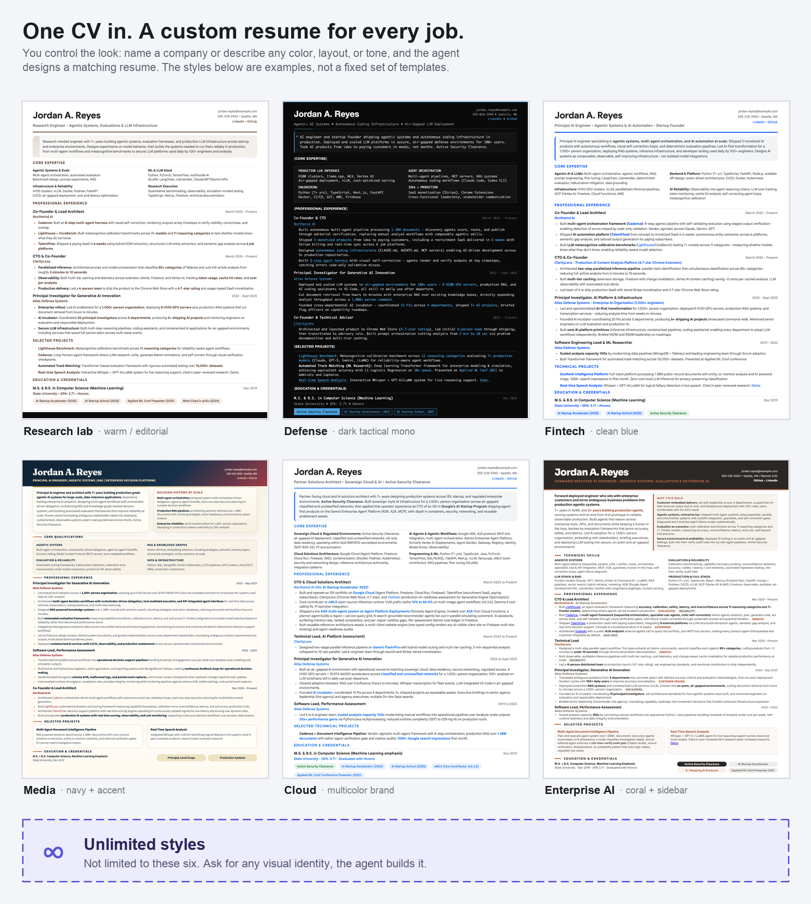
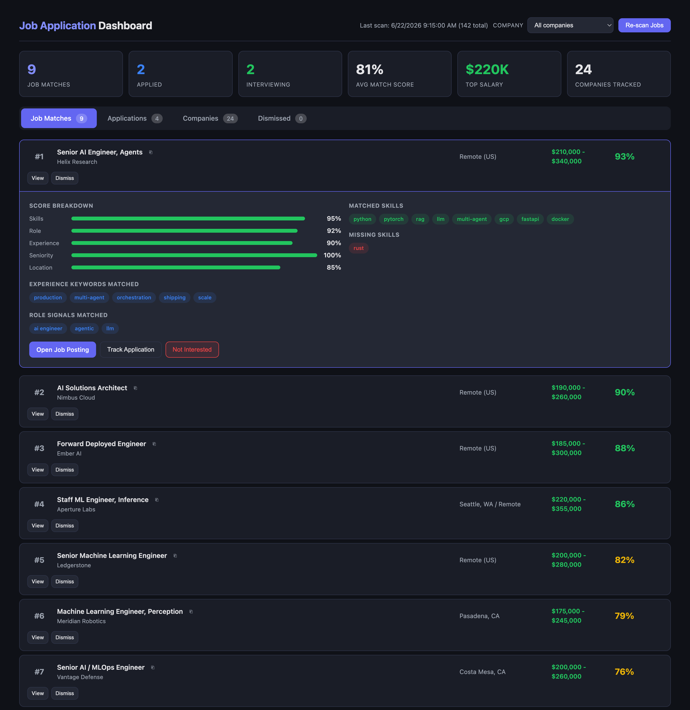

# Job Hunt Agent

Your personal, AI-run job search. Clone it, let your coding agent onboard you
once, and it searches postings, tracks applications, tailors one-page resumes to
each JD, and keeps your master CV current as your work evolves.

Built for agent CLIs (Claude Code, Codex, Gemini/Antigravity, Pi). One `AGENTS.md`
drives them all.



*One master CV in, a custom visual identity per posting out. You control the look,
name a company or describe any color, layout, or tone, and the agent designs it.
The styles aren't a fixed set of templates. Examples use a fictional persona; full
renders in [`docs/examples/`](docs/examples).*

### It finds the jobs, too

Not just resumes. The agent scans ATS boards and ranks every posting against your
profile, role fit, skills, seniority, and your location rules, so you see the
matches worth your time with a transparent score breakdown instead of a wall of
listings. Track applications and comp from the same dashboard.



## Quickstart

```bash
git clone https://github.com/latent-variable/job-hunt-agent.git
cd job-hunt-agent
```

Open the folder in your agent and say:

> Onboard me.

The agent runs `skills/onboarding.md`: it asks where your resume lives, reads the
projects/repos you want highlighted, captures your preferences and your rules,
then fills in `profile/`. After that it's *your* agent, point it at a job and it
tailors a resume, or ask it to find roles that fit you.

Python tooling needs 3.12+ with `requests` + `beautifulsoup4`. PDF rendering needs
Node and system Chrome:

```bash
cd html2pdf && npm install   # puppeteer-core, uses your installed Chrome
```

## What it does

- **Onboards** you from your existing resume + a walk through your real projects.
- **Searches** ATS boards (Greenhouse, Lever, Ashby, Eightfold, TalentBrew) and
  ranks results against your profile.
- **Tracks** companies and applications with status, comp, and dedupe.
- **Tailors** one-page resumes (and matching cover letters) per JD, each with a
  distinct visual theme, then renders verified PDF + PNG.
- **Updates** your master CV as you ship new work.

## Layout

```
AGENTS.md            # the agent's instructions (CLAUDE.md symlinks here)
profile/
  PROFILE.md         # who you are, preferences, your rules  (you fill this)
  MASTER_CV.md       # master CV, source for every resume    (you fill this)
  ranking_profile.json  # skills/keywords that drive ranking (onboarding writes)
skills/              # onboarding, search, tailor, track, log, update-cv, pdf, interview
tools/               # fetch_jobs, parse_job, rank_jobs, pipeline (Python CLI)
resumes/
  templates/base.html   # US-Letter one-page HTML template
  generated/            # one folder per application (HTML + PDF + PNG)
html2pdf/            # HTML→PDF via puppeteer-core + system Chrome
data/                # companies.json, applications.json, job_postings/
render-resume.sh     # render + one-page check
launch-dashboard.sh  # local tracking dashboard
```

## Your rules win

`profile/PROFILE.md` overrides the defaults in `AGENTS.md`. Don't like the
one-page rule, the tone, the honesty bar? Change it there. The defaults are
sensible, not sacred.

## Tools

```bash
unset PYTHONHOME PYTHONPATH
python3 tools/pipeline.py add "Company" slug greenhouse --careers-url https://...
python3 tools/pipeline.py scan -l "remote" -n 25
python3 tools/rank_jobs.py <slug> -p greenhouse -k "engineer,ml" -l "remote" --detail
./render-resume.sh resumes/generated/<company_role>/<file>.html
./launch-dashboard.sh   # http://localhost:8080
```

## License

MIT. See [LICENSE](LICENSE).
